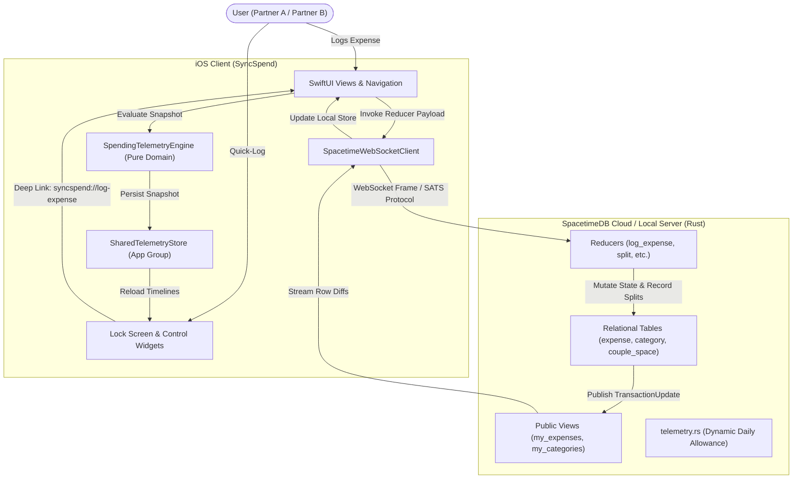

# Domain Guide and System Glossary: Tandem (SyncSpend)

## 1. Overview and Context

SyncSpend is an iOS personal and couple financial budgeting application backed by SpacetimeDB. It replaces traditional, static monthly progress bars with a glanceable daily spending allowance ("Pennies" dynamic micro-pacing), envelope-based category budgeting, and real-time offline-first synchronization between partners.

### The Problem
Traditional budgeting tools cause mid-cycle spending fatigue. Users see large account balances early in the month, spend too fast, and cannot determine whether an everyday expense (such as lunch or groceries) threatens their overall plan. Couples face additional friction: split calculations are manual, spreadsheets become stale, and delayed reconciliation leads to confusion.

### The Solution
SyncSpend anchors budgeting to the user's monthly payday. The system recalculates a dynamic daily allowance every day based on remaining cycle days and past expenditures. If a user spends less than their allowance, the surplus redistributes across future days. If a user overspends today, the system absorbs the deficit across future days without breaking the monthly budget. Real-time SpacetimeDB subscriptions ensure that couple expenses, split adjustments, and category envelope states propagate between partners within milliseconds.

---

## 2. Core Functional Pillars

### Pillar 1: Payday Cycle & Daily Allowance Engine (Micro-Pacing)
- **Operational Flow**:
  1. The user configures their monthly payday start day (clamped between 1 and 28).
  2. The system anchors the active window: `[previous_payday, next_payday)`.
  3. At the beginning of each day $d$, the engine computes the **Base Daily Allowance**:
     $$A_{\text{base}}(d) = \left\lfloor \frac{B - S_{\text{prior}}}{R_d} \right\rfloor$$
     where $B$ is total monthly budget, $S_{\text{prior}}$ is spending prior to day $d$, and $R_d$ is remaining days including today.
  4. As expenses occur throughout day $d$, the engine updates **Available to Spend Today**:
     $$A_{\text{today}}(d) = A_{\text{base}}(d) - S_{\text{today}}$$
  5. If $A_{\text{today}}$ falls below zero, the health state transitions to `OVER_TODAY`. If cumulative spending exceeds $B$, state transitions to `OVER_CYCLE`.
- **System Boundaries**: Starts at user payday configuration; ends at immutable `PaceTelemetry` and `BudgetHealthState` calculations.
- **Integration Handoffs**: Evaluated natively in Swift via `SpendingTelemetryEngine.swift` and mirrored in Rust via `telemetry.rs`. Exported to WidgetKit extensions through App Group container files (`group.com.tandem.syncspend`).

### Pillar 2: Category Envelope Management
- **Operational Flow**:
  1. Users create Category Envelopes with designated monthly integer-cent limits, SF Symbol icons, and hex colors.
  2. Expenses reference a specific `category_id`.
  3. The engine aggregates envelope headroom ($B_{\text{cat}} - S_{\text{cat}}$) and computes per-category daily allowances.
  4. Overspent envelopes trigger visual indicators without blocking transaction logging.
  5. Decommissioned categories are marked with `is_archived = true` to preserve historic expense linkages while removing the category from active pickers.
- **System Boundaries**: Starts at category creation and envelope threshold setting; ends at `EnvelopeTelemetry` snapshot generation and envelope dashboard presentation.
- **Integration Handoffs**: Persisted in SpacetimeDB `category` table; queried via public view `my_categories`.

### Pillar 3: Real-Time SpacetimeDB & Offline-First Synchronization
- **Operational Flow**:
  1. Client establishes a persistent WSS connection to SpacetimeDB using JSON/SATS wire protocol.
  2. Client authenticates via SpacetimeDB Identity (OIDC/JWT) stored in the iOS Keychain.
  3. Client subscribes to public views: `my_categories`, `my_expenses`, `my_profile`, and `my_couple_space`.
  4. Local user actions dispatch reducers (`log_expense`, `update_expense`, `soft_delete_expense`).
  5. Server validates ownership and inputs, mutates relational tables inside an atomic transaction, and broadcasts `TransactionUpdate` messages containing inserted/updated/deleted row diffs.
- **System Boundaries**: Starts at network request dispatch; ends at in-memory state synchronization in `SpacetimeService`.
- **Integration Handoffs**: SpacetimeDB WebSocket protocol (`v1.json.spacetimedb`), iOS URLSessionWebSocketTask, and Keychain Services.

### Pillar 4: Multiplayer Couple Space & Expense Splitting
- **Operational Flow**:
  1. A user creates a Couple Space with defined split ratios (e.g. 50/50, 60/40 summing to 100%).
  2. The server creates a 6-character cryptographic invite code with a 7-day expiration.
  3. The invited partner enters the code to bind their SpacetimeDB `Identity` to the space as `partner_b`.
  4. When either partner logs an expense tagged with `space_id`, they select a `split_mode` (`PERSONAL`, `EQUAL`, `PROPORTIONAL`, or `PAID_FOR_PARTNER`).
  5. The server calculates integer-cent obligations and inserts an `ExpenseSplit` record. Both partners receive live updates via `my_expenses`.
- **System Boundaries**: Starts at invite generation and code acceptance; ends at bilateral visibility and debt balance aggregation.
- **Integration Handoffs**: SpacetimeDB reducers `create_couple_space`, `join_couple_space`, `log_couple_expense`, and table `expense_split`.

---

## 3. Comprehensive Domain Glossary (ASD-STE100 Aligned)

### 3.1 Core Financial & Budgeting Entities

| Term | Approved Definition (STE) | Technical Role & Code Reference | Forbidden Synonyms (Do Not Use) |
| :--- | :--- | :--- | :--- |
| **Payday Cycle** | The recurring monthly budgeting window `[previous_payday, next_payday)` anchored to a user's payday (clamped to days 1–28). | Swift: `PaydayCycle.swift` Rust: `UserProfile.billing_cycle_start_day` | Billing cycle, budget period, pay period |
| **Expense** | An expenditure of integer cents logged by an owner, assigned to a category and payment method, with optional soft-deletion and couple space tagging. | Swift: `ExpenseItem.swift` Rust: `Expense` table in `lib.rs` | Transaction, purchase, charge, line item |
| **Category Envelope** | A designated monthly budget allocation in integer cents for a specific spending category, supporting live remaining balances and overspend warnings. | Swift: `CategoryItem.swift` Rust: `Category` table in `lib.rs` | Budget bucket, category limit, budget pool, spending cap |
| **Integer Cents** | Currency values stored and calculated strictly as whole numbers multiplied by 100 (e.g. R 150.00 is stored as 15000) to prevent floating-point errors. | Swift: `Int64` (`amountCents`, `monthlyBudgetCents`) Rust: `i64` | Float, double, dollar amount, decimal price |
| **Funding Account** | An account or payment method (such as Cash, Debit Card, or Credit Card) selected when logging an expense. | Swift: `AccountItem.swift`, `paymentMethod` in `NewExpenseViewModel.swift` | Bank profile, ledger, user account |
| **Starter Categories** | Five default category envelopes seeded when a new user profile is created: Groceries, Dining & Coffee, Transport / Fuel, Utilities, and Personal Fun. | Rust: `initialize_user_profile` in `lib.rs` Swift: `AddCategorySheet.swift` | Template categories, default buckets |

### 3.2 Spending Telemetry & Micro-Pacing Metrics

| Term | Approved Definition (STE) | Technical Role & Code Reference | Forbidden Synonyms (Do Not Use) |
| :--- | :--- | :--- | :--- |
| **Spending Telemetry** | The consolidated financial state of a payday cycle, comprising cumulative pace projections, category envelope statuses, and time-bucketed spending curves. | Swift: `SpendingTelemetrySnapshot.swift` Rust: `telemetry.rs` | Analytics, chart stats, dashboard stats, BI data |
| **Cycle Pace** | The comparison between actual cumulative spending to date and the ideal linear daily allowance curve within the active payday cycle. | Swift: `PaceTelemetry`, `CyclePacePoint` Rust: `DailyBudgetTelemetry` | Burn rate, velocity, spend rate |
| **Base Daily Allowance** | The calculated allowance at the start of a calendar day, obtained by dividing unspent budget from prior days by remaining cycle days ($A_{\text{base}}$). | Swift: `todayBaseAllowanceCents` Rust: `today_base_allowance_cents` | Daily budget, daily quota, baseline allowance |
| **Available to Spend Today** | The remaining allowance for the current day after subtracting today's logged expenses from the Base Daily Allowance ($A_{\text{today}}$). | Swift: `todayAvailableCents` Rust: `today_available_cents` | Daily remaining, day cash, remaining today |
| **Cycle Headroom** | The total unspent amount remaining across the entire active payday cycle ($B - S_{\text{cycle}}$). | Swift: `freeToSpendCents` Rust: `cycle_headroom_cents` | Remaining budget, overall surplus, cycle balance |
| **Budget Health State** | One of four states describing cycle or day spending: `HEALTHY` (spend $\le 80\%$), `CAUTION` (spend $> 80\%$), `OVER_TODAY` (spent $> A_{\text{base}}$), or `OVER_CYCLE` (total spent $> B$). | Swift: `BudgetHealthState` Rust: `health_state` in `telemetry.rs` | Traffic light, status code, alert level |
| **Filter Period** | A discrete time frame used for historical chart distribution: Today, This Week, This Month, This Year, or All Time. | Swift: `FilterPeriod.swift` | Date range, timeframe, slice |

### 3.3 Multiplayer & Couple Synchronization

| Term | Approved Definition (STE) | Technical Role & Code Reference | Forbidden Synonyms (Do Not Use) |
| :--- | :--- | :--- | :--- |
| **Couple Space** | A shared domain context linking two distinct user identities with defined split ratios for cooperative expense tracking. | Swift: `CoupleSpace.swift` Rust: `CoupleSpace` table in `lib.rs` | Shared room, joint account, couple profile |
| **Partner A / Partner B** | The two authenticated user identities participating in a Couple Space (Partner A created the space; Partner B joined via invite code). | Rust: `partner_a`, `partner_b` in `CoupleSpace` Swift: `CoupleSpace.swift` | Husband/wife, user 1/user 2, owner/member |
| **Split Ratio** | The assigned percentage distribution of shared costs between Partner A and Partner B, which must sum exactly to 100% (e.g. 50/50, 60/40). | Rust: `split_ratio_a`, `split_ratio_b` Swift: `CoupleSpace.swift` | Share percentage, split rule, division quota |
| **Couple Invite Code** | A 6-character alphanumeric code generated using Base32 without ambiguous characters (0, O, 1, I) with a 7-day expiration, used to pair partners. | Rust: `CoupleInvite` table in `lib.rs` Swift: `SettingsView.swift` | Referral code, pairing PIN, room token |
| **Split Mode** | The calculation rule for a specific expense: `PERSONAL` (100% payer), `EQUAL` (50/50), `PROPORTIONAL` (uses space split ratio), or `PAID_FOR_PARTNER` (100% partner). | Rust: `split_mode` in `lib.rs` Swift: `ExpenseItem.splitMode` | Share type, split option, division mode |
| **Expense Split** | An immutable record documenting the exact integer-cent shares owed by Partner A and Partner B for an individual couple expense. | Rust: `ExpenseSplit` table in `lib.rs` | Split receipt, share ledger, IOUs |
| **Soft Deletion** | Marking an entity as deleted using a timestamp field (`deleted_at`) rather than removing the row from the database, enabling recovery and auditability. | Rust: `deleted_at` in `Expense` Swift: `ExpenseItem.deletedAtMillis` | Hard delete, purge, drop record |

### 3.4 Infrastructure, Protocols & Client Storage

| Term | Approved Definition (STE) | Technical Role & Code Reference | Forbidden Synonyms (Do Not Use) |
| :--- | :--- | :--- | :--- |
| **SpacetimeDB** | The relational database and WebAssembly execution engine running server-side modules and handling real-time client synchronization. | Rust crate `spacetimedb` Swift `SpacetimeService.swift` | Backend server, API, cloud database |
| **Reducer** | A pure server-side transaction function in Rust that mutates SpacetimeDB table state in response to an authenticated client request. | Rust: `#[reducer]` functions in `lib.rs` | Endpoint, controller, RPC handler, mutation |
| **Public View** | A secure SQL projection in SpacetimeDB that filters table rows by caller identity (`ctx.sender`) before sending them to the client. | Rust: `#[view(..., public)]` in `lib.rs` | Query endpoint, GET route, view model |
| **Transaction Update** | A wire-level message emitted by SpacetimeDB across the WebSocket connection containing table row diffs produced by a committed transaction. | Swift: `TransactionUpdateMessage.swift` Protocol: `v1.json.spacetimedb` | Push event, sync packet, websocket delta |
| **SATS** | SpacetimeDB Algebraic Type System: the binary and JSON serialization schema used for typed database rows and reducer arguments. | Protocol serializer in SpacetimeDB | Proto, JSON schema, BSON |
| **Identity** | A 32-byte unique cryptographic public key representing an authenticated user in SpacetimeDB. | Rust: `spacetimedb::Identity` Swift: `IdentityString` in `AuthService.swift` | User ID, UUID, GUID, session token |
| **App Group Telemetry Store** | A local shared persistence bridge using an Apple App Group (`group.com.tandem.syncspend`) to share telemetry data between the main app and widgets. | Swift: `SharedTelemetryStore.swift` | Shared prefs, widget cache, local storage |
| **Quick-Log Widget** | An iOS Lock Screen widget or Control Widget that triggers immediate expense logging via deep link URL (`syncspend://log-expense`). | Swift: `QuickLogWidget.swift`, `QuickLogControlWidget.swift` | Shortcut, complication, lock icon |

---

## 4. Contradictions & Overloaded Terms

| Contradiction / Term Collision | Where It Occurs | The Confusion / Risk | Canonical Ruling |
| :--- | :--- | :--- | :--- |
| **Transaction vs. Expense** | UI components: `TransactionRowView`, `TransactionGroupListView`, "Recent Transactions". Backend: `Expense` table, `log_expense`. Protocol: `TransactionUpdateMessage`. | The word "transaction" is overloaded. In database architecture, a transaction is an atomic commit of row diffs. In consumer finance, developers mistakenly call an expenditure a transaction. | **Expense** is the canonical domain term for an expenditure logged by a user. **Transaction** is strictly reserved for database/protocol updates (`TransactionUpdate`). Replace UI references with "Expense". |
| **Billing Cycle vs. Payday Cycle** | Backend: `UserProfile.billing_cycle_start_day`. Domain & Swift: `PaydayCycle`. | "Billing cycle" implies recurring utility or credit card statements. SyncSpend anchors budgeting specifically to the user's monthly payday (1–28). | **Payday Cycle** is the canonical term. The backend column `billing_cycle_start_day` represents the payday anchor date. |
| **Budget Bucket / Pool vs. Category Envelope** | Prototype HTML & legacy discussion notes: "envelope-pill", "budget bucket", "budget pool". | Inconsistent terminology between traditional envelope budgeting and generic bucket models obscures the core dynamic allowance calculation. | **Category Envelope** is the canonical term. Never use "Budget Bucket", "Pool", or "Category Limit". |
| **Account (User Identity vs. Funding Account)** | Swift: `AccountItem` (Personal, Business, Savings). Auth: SpacetimeDB `Identity` / user account. UI: `AccountsSheet.swift`. | Using "account" for both the user's sign-in profile and the funding source (debit card, cash, savings) causes severe architectural confusion. | **User Profile** refers to the person and authentication identity. **Funding Account** refers to the payment source (`AccountItem`). |
| **Burn Rate vs. Cycle Pace** | Prototypes and notes: "ENVELOPE BURN PACING", "burn rate". | "Burn rate" is corporate startup jargon implying cash exhaustion. In consumer budgeting, pace measures adherence to an ideal linear trajectory. | **Cycle Pace** is the canonical term, measured with **Ideal Cumulative Pace** and **Actual Cumulative Pace**. |
| **Daily Budget vs. Daily Allowance** | Informal speech vs. Telemetry models. | "Daily budget" sounds like a fixed static number (e.g. R 200/day). In SyncSpend, the allowance dynamically changes every morning and after every expense. | Use **Base Daily Allowance** ($A_{\text{base}}$) for the morning baseline, and **Available to Spend Today** ($A_{\text{today}}$) for the live remaining allowance. |
