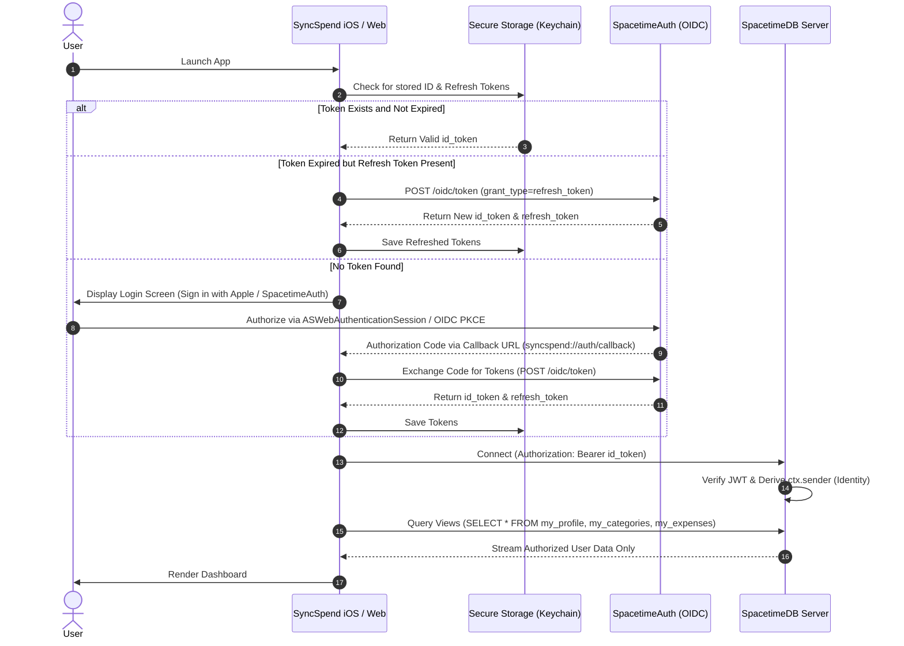

# Research Report: SpacetimeDB Authentication & Database Security Architecture

**Author**: Antigravity Research Agent  
**Date**: September 1, 2026  
**Status**: Approved Specification / Architecture Blueprint  
**Target Application**: SyncSpend / Tandem (iOS SwiftUI & React Prototype)  
**SpacetimeDB Target Version**: `1.12.0` (and `2.0` migration ready)

---

## Executive Summary

SyncSpend is a multi-tenant personal and couples expense tracking application built on SpacetimeDB. The current codebase contains a critical architectural security flaw: **all tables are marked `public` and all data is queried via raw SQL (`SELECT * FROM table;`) with client-side filtering**. In SpacetimeDB, declaring a table `public` exposes all rows across the network to any connected client.

This research document outlines the end-to-end architecture required to:
1. **Cryptographically secure all database tables and reducers** using SpacetimeDB's private table and fine-grained view model (`#[spacetimedb::view]`).
2. **Integrate OpenID Connect (OIDC) Authentication** via **SpacetimeAuth** (or native Sign in with Apple / Clerk / Auth0).
3. **Implement an App Startup Login & Session Management Flow** for native iOS (SwiftUI + `ASWebAuthenticationSession` / Keychain) and Web (React + `react-oidc-context`).
4. **Establish deterministic Identity mapping and multi-tenant isolation** for single users and couple spaces (`partner_a` & `partner_b`).

---

## 1. Threat Model & Current State Audit

### 1.1 The Current Vulnerability
In `syncspend/server/src/lib.rs`, every table is currently defined with the `public` modifier:
```rust
#[spacetimedb::table(name = user_profile, public)]
pub struct UserProfile { ... }

#[spacetimedb::table(name = expense, public)]
pub struct Expense { ... }

#[spacetimedb::table(name = couple_space, public)]
pub struct CoupleSpace { ... }
```

In `syncspend/ios/SyncSpend/Services/SpacetimeService.swift`, the client runs:
```swift
request.httpBody = "SELECT * FROM expense;".data(using: .utf8)
```
And then filters rows locally on the device:
```swift
let cleanOwner = (row[1] as? String)?.lowercased() ?? ""
let cleanMy = myIdent.lowercased()
if cleanOwner != cleanMy { return nil }
```

### 1.2 Security Implications
- **Data Leakage**: Any client can execute `SELECT * FROM expense;` or subscribe to `expense` and immediately receive all unencrypted expense amounts, descriptions, categories, and identities of every user registered on the database instance.
- **Identity Spoofing**: Ephemeral anonymous identities minted via `POST /v1/identity` are tied only to device-stored tokens. If unauthenticated reducers accept arbitrary arguments, a compromised client could manipulate records.
- **Session Vulnerability**: Auth tokens stored in `UserDefaults` are accessible on jailbroken devices and unencrypted backups; tokens must be stored in the **iOS Keychain**.

---

## 2. SpacetimeDB Authentication Architecture

### 2.1 How SpacetimeDB Authenticates & Generates Identity
SpacetimeDB uses **OpenID Connect (OIDC)** tokens (standard signed JSON Web Tokens / JWTs) to establish identity:
1. When a client connects with an `Authorization: Bearer <id_token>` HTTP header or WebSocket connection parameter (`DbConnection.builder().withToken(id_token)`), SpacetimeDB validates:
   - The cryptographic signature against the provider's public JSON Web Key Set (JWKS).
   - Token validity (expiration `exp`, not-before `nbf`, issuer `iss`, and audience `aud`).
2. SpacetimeDB computes the caller's immutable `Identity` by hashing the tuple `(issuer, subject)`:
   $$\text{Identity} = \text{SHA256}(\text{iss} \parallel \text{sub})$$
3. Inside server-side reducers and views, `ctx.sender` is automatically populated with this verified `Identity`. It cannot be forged or spoofed by the client.

### 2.2 Auth Provider Options

| Provider | Pros | Cons | Best Fit |
| :--- | :--- | :--- | :--- |
| **SpacetimeAuth** (`https://auth.spacetimedb.com/oidc`) | Managed by Clockwork Labs; pre-integrated with Google, GitHub, Apple, Discord; zero custom backend needed; standard OIDC Authorization Code Flow with PKCE. | Currently in beta; requires SpacetimeAuth project configuration. | **Primary / Recommended** for unified Web + Mobile authentication. |
| **Sign in with Apple (Direct OIDC)** | Native iOS UX; built into iOS `AuthenticationServices`; fast biometric authorization (FaceID/TouchID). | Requires custom Apple Developer Service ID and private key configuration to use across web/backend. | **Native iOS Dedicated Flow**. |
| **Clerk / Auth0** | Mature user management dashboards, MFA, organization support, session management. | Requires separate third-party paid service setup and custom JWT template configuration. | Enterprise / External SaaS integration. |

---

## 3. SpacetimeAuth Configuration Blueprint

### 3.1 Project & Client Setup
1. **Create SpacetimeAuth Project**:
   - Access the SpacetimeAuth Dashboard at `https://auth.spacetimedb.com`.
   - Create a project named `syncspend-auth`.
2. **Configure Identity Providers**:
   - **Apple Sign-In**: Configure Apple Team ID, Key ID, Services ID, and private key (`.p8`).
   - **Google Sign-In**: Configure Google OAuth Client ID & Secret.
3. **Configure Allowed Redirect URIs**:
   - **Local Web / Dev**: `http://localhost:5173/callback`, `http://localhost:3000/callback`
   - **Testing**: `https://oidcdebugger.com/debug`
   - **Native iOS App Scheme**: `syncspend://auth/callback` or `tandem://callback`
   - **Universal Links (Production iOS)**: `https://syncspend.app/auth/callback`

### 3.2 OIDC Endpoints & Standard Claims
- **Issuer (`iss`)**: `https://auth.spacetimedb.com/oidc`
- **Authorization Endpoint**: `https://auth.spacetimedb.com/oidc/auth`
- **Token Endpoint**: `https://auth.spacetimedb.com/oidc/token`
- **JWKS URI**: `https://auth.spacetimedb.com/oidc/.well-known/jwks.json`
- **Requested Scopes**: `openid profile email offline_access`

**Sample Decoded ID Token (`id_token`)**:
```json
{
  "iss": "https://auth.spacetimedb.com/oidc",
  "sub": "user_01hx98bc72a0f12d8",
  "aud": "client_syncspend_mobile_app",
  "exp": 1756732800,
  "iat": 1756729200,
  "email": "partner1@example.com",
  "email_verified": true,
  "name": "Jordan Scarrott",
  "preferred_username": "jordan",
  "project_id": "project_syncspend"
}
```

---

## 4. Backend Database Hardening (Rust Module)

### 4.1 Transitioning from Public Tables to Private Tables
To secure data at rest and across the wire, all sensitive tables must drop the `public` flag. In SpacetimeDB, tables without `public` are strictly private to the server module and cannot be queried or subscribed to by unauthorized clients.

```rust
// syncspend/server/src/lib.rs

use spacetimedb::{table, view, Identity, Timestamp, ReducerContext, ViewContext, SpacetimeType};

// PRIVATE TABLE: Cannot be directly queried or subscribed to by clients
#[spacetimedb::table(name = user_profile)]
pub struct UserProfile {
    #[primary_key]
    pub identity: Identity,
    pub display_name: String,
    pub default_currency: String,
    pub billing_cycle_start_day: u8,
    pub created_at: Timestamp,
    pub updated_at: Timestamp,
}

// PRIVATE TABLE: Contains personal and couple categories
#[spacetimedb::table(name = category)]
pub struct Category {
    #[primary_key]
    #[auto_inc]
    pub id: u64,
    #[index(btree)]
    pub owner: Identity,
    pub name: String,
    pub icon: String,
    pub color_hex: String,
    pub is_system_default: bool,
    pub is_archived: bool,
}

// PRIVATE TABLE: Contains personal and shared expenses
#[spacetimedb::table(name = expense)]
pub struct Expense {
    #[primary_key]
    #[auto_inc]
    pub id: u64,
    #[index(btree)]
    pub owner: Identity,
    #[index(btree)]
    pub space_id: Option<u64>,
    pub amount_cents: i64,
    pub currency: String,
    pub category_id: u64,
    pub description: String,
    pub date: Timestamp,
    pub paid_by: Identity,
    pub is_deleted: bool,
    pub deleted_at: Option<Timestamp>,
    pub created_at: Timestamp,
    pub updated_at: Timestamp,
}

// PRIVATE TABLE: Couples collaboration spaces
#[spacetimedb::table(name = couple_space)]
pub struct CoupleSpace {
    #[primary_key]
    #[auto_inc]
    pub id: u64,
    #[index(btree)]
    pub partner_a: Identity,
    #[index(btree)]
    pub partner_b: Option<Identity>,
    pub name: String,
    pub currency: String,
    pub created_at: Timestamp,
}
```

### 4.2 Fine-Grained Row Access via Server Views (`#[spacetimedb::view]`)
SpacetimeDB 1.x / 1.12.0 introduces server-side **Views**. A view is a public, read-only endpoint that executes on the server, takes `ctx: &ViewContext`, and uses `ctx.sender` to retrieve only the records the caller is permitted to see.

```rust
// 1. View: Fetch only the caller's categories
#[spacetimedb::view(name = my_categories, public)]
pub fn my_categories(ctx: &ViewContext) -> Vec<Category> {
    ctx.db.category()
        .owner()
        .filter(&ctx.sender)
        .filter(|cat| !cat.is_archived)
        .collect()
}

// 2. View: Fetch only expenses owned by the caller OR in the caller's couple space
#[spacetimedb::view(name = my_expenses, public)]
pub fn my_expenses(ctx: &ViewContext) -> Vec<Expense> {
    // Collect personal expenses owned by caller
    let mut expenses: Vec<Expense> = ctx.db.expense()
        .owner()
        .filter(&ctx.sender)
        .filter(|e| !e.is_deleted)
        .collect();

    // Check if caller belongs to any active CoupleSpace
    let couple_spaces: Vec<CoupleSpace> = ctx.db.couple_space()
        .iter()
        .filter(|space| space.partner_a == ctx.sender || space.partner_b == Some(ctx.sender))
        .collect();

    for space in couple_spaces {
        let space_expenses = ctx.db.expense()
            .space_id()
            .filter(&Some(space.id))
            .filter(|e| !e.is_deleted && e.owner != ctx.sender); // Avoid duplicates
        expenses.extend(space_expenses);
    }

    expenses
}

// 3. View: Fetch the caller's profile
#[spacetimedb::view(name = my_profile, public)]
pub fn my_profile(ctx: &ViewContext) -> Option<UserProfile> {
    ctx.db.user_profile().identity().find(&ctx.sender)
}

// 4. View: Fetch the caller's active couple space
#[spacetimedb::view(name = my_couple_space, public)]
pub fn my_couple_space(ctx: &ViewContext) -> Option<CoupleSpace> {
    ctx.db.couple_space()
        .iter()
        .find(|space| space.partner_a == ctx.sender || space.partner_b == Some(ctx.sender))
}
```

### 4.3 Reducer Authorization & Claims Validation
Reducers must strictly enforce that mutations can only be performed by authorized callers. SpacetimeDB provides `ctx.sender_auth().jwt()` to inspect token claims directly:

```rust
// Reducer token inspection helper
fn verify_caller_auth(ctx: &ReducerContext) -> Result<(), String> {
    if let Some(jwt) = ctx.sender_auth().jwt() {
        // Enforce trusted issuer
        if jwt.issuer() != "https://auth.spacetimedb.com/oidc" {
            return Err("Unauthorized token issuer".to_string());
        }
        // Enforce audience
        let valid_aud = jwt.audience().iter().any(|aud| aud == "syncspend_mobile" || aud == "syncspend_web");
        if !valid_aud {
            return Err("Invalid token audience".to_string());
        }
    }
    Ok(())
}

#[spacetimedb::reducer]
pub fn log_expense(
    ctx: &ReducerContext,
    amount_cents: i64,
    currency: String,
    category_id: u64,
    description: String,
    date: Timestamp,
) -> Result<(), String> {
    verify_caller_auth(ctx)?;

    // Category must belong to caller or be a system default
    let cat = ctx.db.category().id().find(category_id)
        .ok_or_else(|| "Category not found".to_string())?;
    if cat.owner != ctx.sender && !cat.is_system_default {
        return Err("Cannot log expense with unowned category".to_string());
    }

    ctx.db.expense().insert(Expense {
        id: 0,
        owner: ctx.sender, // Guaranteed authenticated sender
        space_id: None,
        amount_cents,
        currency,
        category_id,
        description,
        date,
        paid_by: ctx.sender,
        is_deleted: false,
        deleted_at: None,
        created_at: ctx.timestamp,
        updated_at: ctx.timestamp,
    });

    Ok(())
}
```

---

## 5. Client Startup & Authentication Lifecycle



---

## 6. Implementation Specifications: Native iOS (Swift)

### 6.1 Secure Keychain Manager
Replace `UserDefaults` with a dedicated Keychain helper:

```swift
// SyncSpend/Services/KeychainManager.swift
import Foundation
import Security

public enum KeychainManager {
    private static let service = "com.syncspend.app"
    private static let accountAuthToken = "spacetimedb_auth_token"
    private static let accountRefreshToken = "spacetimedb_refresh_token"

    public static func saveAuthToken(_ token: String) {
        save(key: accountAuthToken, data: Data(token.utf8))
    }

    public static func getAuthToken() -> String? {
        guard let data = load(key: accountAuthToken) else { return nil }
        return String(data: data, encoding: .utf8)
    }

    public static func saveRefreshToken(_ token: String) {
        save(key: accountRefreshToken, data: Data(token.utf8))
    }

    public static func getRefreshToken() -> String? {
        guard let data = load(key: accountRefreshToken) else { return nil }
        return String(data: data, encoding: .utf8)
    }

    public static func clear() {
        delete(key: accountAuthToken)
        delete(key: accountRefreshToken)
    }

    private static func save(key: String, data: Data) {
        let query: [String: Any] = [
            kSecClass as String: kSecClassGenericPassword,
            kSecAttrService as String: service,
            kSecAttrAccount as String: key,
            kSecValueData as String: data,
            kSecAttrAccessible as String: kSecAttrAccessibleAfterFirstUnlock
        ]
        SecItemDelete(query as CFDictionary)
        SecItemAdd(query as CFDictionary, nil)
    }

    private static func load(key: String) -> Data? {
        let query: [String: Any] = [
            kSecClass as String: kSecClassGenericPassword,
            kSecAttrService as String: service,
            kSecAttrAccount as String: key,
            kSecReturnData as String: true,
            kSecMatchLimit as String: kSecMatchLimitOne
        ]
        var dataTypeRef: AnyObject?
        let status = SecItemCopyMatching(query as CFDictionary, &dataTypeRef)
        return status == errSecSuccess ? (dataTypeRef as? Data) : nil
    }

    private static func delete(key: String) {
        let query: [String: Any] = [
            kSecClass as String: kSecClassGenericPassword,
            kSecAttrService as String: service,
            kSecAttrAccount as String: key
        ]
        SecItemDelete(query as CFDictionary)
    }
}
```

### 6.2 Authentication Session & Startup Coordinator (`AuthService.swift`)
Handles the OAuth2 / PKCE flow with `ASWebAuthenticationSession`:

```swift
// SyncSpend/Services/AuthService.swift
import Foundation
import AuthenticationServices
import CryptoKit

@Observable
public final class AuthService: NSObject, ASWebAuthenticationPresentationContextProviding {
    public static let shared = AuthService()

    public var isAuthenticated: Bool = false
    public var currentUserEmail: String?
    public var currentUserName: String?

    private let authAuthority = "https://auth.spacetimedb.com/oidc"
    private let clientId = "syncspend_ios_client"
    private let redirectURI = "syncspend://auth/callback"
    private var codeVerifier: String?

    public override init() {
        super.init()
        checkExistingSession()
    }

    public func presentationAnchor(for session: ASWebAuthenticationSession) -> ASPresentationAnchor {
        guard let windowScene = UIApplication.shared.connectedScenes.first as? UIWindowScene,
              let window = windowScene.windows.first else {
            return ASPresentationAnchor()
        }
        return window
    }

    public func checkExistingSession() {
        if let token = KeychainManager.getAuthToken(), !token.isEmpty {
            self.isAuthenticated = true
            SpacetimeService.shared.authToken = token
        } else {
            self.isAuthenticated = false
        }
    }

    public func loginWithSpacetimeAuth() async throws {
        // 1. Generate PKCE code_verifier and code_challenge
        let verifier = generateCodeVerifier()
        self.codeVerifier = verifier
        let challenge = generateCodeChallenge(from: verifier)

        // 2. Build authorize URL
        var components = URLComponents(string: "\(authAuthority)/auth")!
        components.queryItems = [
            URLQueryItem(name: "client_id", value: clientId),
            URLQueryItem(name: "response_type", value: "code"),
            URLQueryItem(name: "scope", value: "openid profile email offline_access"),
            URLQueryItem(name: "redirect_uri", value: redirectURI),
            URLQueryItem(name: "code_challenge", value: challenge),
            URLQueryItem(name: "code_challenge_method", value: "S256"),
            URLQueryItem(name: "state", value: UUID().uuidString)
        ]

        guard let authURL = components.url else { throw URLError(.badURL) }

        // 3. Launch ASWebAuthenticationSession
        let callbackURL = try await withCheckedThrowingContinuation { (continuation: CheckedContinuation<URL, Error>) in
            let session = ASWebAuthenticationSession(
                url: authURL,
                callbackURLScheme: "syncspend"
            ) { callbackURL, error in
                if let error = error {
                    continuation.resume(throwing: error)
                } else if let callbackURL = callbackURL {
                    continuation.resume(returning: callbackURL)
                } else {
                    continuation.resume(throwing: URLError(.unknown))
                }
            }
            session.presentationContextProvider = self
            session.prefersEphemeralWebBrowserSession = false
            session.start()
        }

        // 4. Extract authorization code
        guard let code = URLComponents(url: callbackURL, resolvingAgainstBaseURL: false)?
            .queryItems?.first(where: { $0.name == "code" })?.value else {
            throw NSError(domain: "AuthService", code: 2, userInfo: [NSLocalizedDescriptionKey: "Missing code in callback"])
        }

        // 5. Exchange code for tokens
        try await exchangeCodeForTokens(code: code, verifier: verifier)
    }

    private func exchangeCodeForTokens(code: String, verifier: String) async throws {
        guard let tokenURL = URL(string: "\(authAuthority)/token") else { throw URLError(.badURL) }
        var request = URLRequest(url: tokenURL)
        request.httpMethod = "POST"
        request.setValue("application/x-www-form-urlencoded", forHTTPHeaderField: "Content-Type")

        let bodyParams = [
            "grant_type": "authorization_code",
            "client_id": clientId,
            "code": code,
            "redirect_uri": redirectURI,
            "code_verifier": verifier
        ]
        request.httpBody = bodyParams.map { "\($0.key)=\($0.value.addingPercentEncoding(withAllowedCharacters: .urlQueryAllowed) ?? "")" }
            .joined(separator: "&")
            .data(using: .utf8)

        let (data, response) = try await URLSession.shared.data(for: request)
        guard let httpRes = response as? HTTPURLResponse, httpRes.statusCode == 200 else {
            throw NSError(domain: "AuthService", code: 3, userInfo: [NSLocalizedDescriptionKey: "Failed to exchange token"])
        }

        if let json = try JSONSerialization.jsonObject(with: data) as? [String: Any],
           let idToken = json["id_token"] as? String {
            KeychainManager.saveAuthToken(idToken)
            if let refreshToken = json["refresh_token"] as? String {
                KeychainManager.saveRefreshToken(refreshToken)
            }
            SpacetimeService.shared.authToken = idToken
            self.isAuthenticated = true
        }
    }

    public func logout() {
        KeychainManager.clear()
        SpacetimeService.shared.authToken = nil
        self.isAuthenticated = false
    }

    // Helper: PKCE code verifier
    private func generateCodeVerifier() -> String {
        var buffer = [UInt8](repeating: 0, count: 32)
        _ = SecRandomCopyBytes(kSecRandomDefault, buffer.count, &buffer)
        return Data(buffer).base64EncodedString()
            .replacingOccurrences(of: "+", with: "-")
            .replacingOccurrences(of: "/", with: "_")
            .trimmingCharacters(in: CharacterSet(charactersIn: "="))
    }

    // Helper: PKCE code challenge
    private func generateCodeChallenge(from verifier: String) -> String {
        let data = Data(verifier.utf8)
        let hash = SHA256.hash(data: data)
        return Data(hash).base64EncodedString()
            .replacingOccurrences(of: "+", with: "-")
            .replacingOccurrences(of: "/", with: "_")
            .trimmingCharacters(in: CharacterSet(charactersIn: "="))
    }
}
```

### 6.3 Refactored SpacetimeService Querying Views
Update `SpacetimeService.swift` to fetch from `my_categories` and `my_expenses` instead of querying raw tables:

```swift
// SyncSpend/Services/SpacetimeService.swift (View queries)

public func fetchCategories() async throws -> [CategoryItem] {
    guard let url = URL(string: "\(hostURL)/v1/database/\(databaseName)/sql") else { return [] }
    var request = URLRequest(url: url)
    request.httpMethod = "POST"
    request.setValue("text/plain", forHTTPHeaderField: "Content-Type")
    if let token = authToken {
        request.setValue("Bearer \(token)", forHTTPHeaderField: "Authorization")
    }

    // QUERY SERVER VIEW INSTEAD OF RAW TABLE
    request.httpBody = "SELECT * FROM my_categories;".data(using: .utf8)

    let (data, response) = try await URLSession.shared.data(for: request)
    guard let httpRes = response as? HTTPURLResponse, httpRes.statusCode == 200 else { return [] }

    guard let jsonArray = try JSONSerialization.jsonObject(with: data) as? [[String: Any]],
          let firstResult = jsonArray.first,
          let rows = firstResult["rows"] as? [[Any]] else { return [] }

    // No client-side owner filtering needed! SpacetimeDB server guarantees row isolation.
    return rows.compactMap { row -> CategoryItem? in
        guard row.count >= 6,
              let id = (row[0] as? NSNumber)?.uint64Value,
              let name = row[2] as? String,
              let icon = row[3] as? String,
              let colorHex = row[4] as? String else { return nil }
        return CategoryItem(id: id, name: name, icon: icon, colorHex: colorHex)
    }
}
```

---

## 7. Implementation Specifications: Web / React Prototype

In the React prototype (`src/main.tsx` and `src/App.tsx`), integration with `react-oidc-context` ensures seamless login and token injection into `DbConnection`:

```tsx
// src/main.tsx
import React from 'react';
import ReactDOM from 'react-dom/client';
import { AuthProvider, useAuth } from 'react-oidc-context';
import App from './App';

const oidcConfig = {
  authority: 'https://auth.spacetimedb.com/oidc',
  client_id: 'syncspend_web_client',
  redirect_uri: window.location.origin + '/callback',
  response_type: 'code',
  scope: 'openid profile email offline_access',
};

ReactDOM.createRoot(document.getElementById('root')!).render(
  <React.StrictMode>
    <AuthProvider {...oidcConfig}>
      <App />
    </AuthProvider>
  </React.StrictMode>
);
```

```tsx
// src/App.tsx
import React, { useMemo } from 'react';
import { useAuth } from 'react-oidc-context';
import { DbConnection } from './module_bindings';

export default function App() {
  const auth = useAuth();

  const conn = useMemo(() => {
    if (!auth.isAuthenticated || !auth.user?.id_token) {
      return null;
    }
    return DbConnection.builder()
      .withUri('https://maincloud.spacetimedb.com')
      .withModuleName('ad-guitar-1941')
      .withToken(auth.user.id_token) // Pass verified OIDC ID Token
      .build();
  }, [auth.isAuthenticated, auth.user?.id_token]);

  if (auth.isLoading) {
    return <div className="loading-screen">Authenticating with SpacetimeDB...</div>;
  }

  if (!auth.isAuthenticated) {
    return (
      <div className="login-screen">
        <h2>Welcome to SyncSpend</h2>
        <button onClick={() => auth.signinRedirect()}>Sign in with SpacetimeAuth</button>
      </div>
    );
  }

  return (
    <div className="app-container">
      <header>
        <span>Logged in as: {auth.user?.profile.email}</span>
        <button onClick={() => auth.signoutRedirect()}>Sign Out</button>
      </header>
      {/* Dashboard & Views */}
    </div>
  );
}
```

---

## 8. Step-by-Step Implementation Roadmap

| Step | Component | Action Items | Risk / Complexity |
| :--- | :--- | :--- | :--- |
| **Phase 1** | **Backend (Rust Module)** | 1. Remove `public` from all sensitive tables (`UserProfile`, `Category`, `Expense`, `CoupleSpace`, `CoupleInvite`, `ExpenseSplit`).<br>2. Define `#[spacetimedb::view]` functions for `my_categories`, `my_expenses`, `my_profile`, `my_couple_space`.<br>3. Add caller validation & JWT claims checks in all reducers.<br>4. Re-publish module to SpacetimeDB (`spacetime publish`). | Medium (Schema & permission change) |
| **Phase 2** | **Auth Dashboard** | 1. Create project on `https://auth.spacetimedb.com`.<br>2. Configure Google & Apple OAuth credentials.<br>3. Add redirect URIs (`syncspend://auth/callback`, `http://localhost:5173/callback`). | Low (Configuration) |
| **Phase 3** | **iOS Client (Swift)** | 1. Implement `KeychainManager.swift` for secure token storage.<br>2. Implement `AuthService.swift` with `ASWebAuthenticationSession` and PKCE flow.<br>3. Update `SpacetimeService.swift` to query server views (`SELECT * FROM my_categories;`, `SELECT * FROM my_expenses;`) and remove client-side filtering.<br>4. Build `LoginView.swift` & wire startup check in `SyncSpendApp.swift`. | Medium (UI & lifecycle integration) |
| **Phase 4** | **React Client** | 1. Install `react-oidc-context`.<br>2. Configure `AuthProvider` and pass `auth.user.id_token` to `DbConnection.builder().withToken()`.<br>3. Verify subscriptions to server views. | Low (Standard React pattern) |
| **Phase 5** | **Testing & Validation** | 1. Verify token generation using OIDC Debugger (`https://oidcdebugger.com`).<br>2. Execute multi-user segregation tests (User A cannot read User B's records).<br>3. Validate couple space sharing (User A and User B in same space can both see shared expenses). | Low |

---

## 9. Primary Source Citations

1. **SpacetimeDB Authentication Core Concepts**:  
   [SpacetimeDB Authentication Documentation](https://spacetimedb.com/docs/1.12.0/core-concepts/authentication)
2. **SpacetimeAuth Architecture & Project Setup**:  
   [SpacetimeAuth Setup Guide](https://spacetimedb.com/docs/1.12.0/core-concepts/authentication/spacetimeauth/)  
   [Creating a Project](https://spacetimedb.com/docs/1.12.0/core-concepts/authentication/spacetimeauth/creating-a-project)  
   [Configuring your Project](https://spacetimedb.com/docs/1.12.0/core-concepts/authentication/spacetimeauth/configuring-a-project)
3. **Testing SpacetimeAuth Flows (PKCE & OIDC Debugger)**:  
   [Testing SpacetimeAuth](https://spacetimedb.com/docs/1.12.0/core-concepts/authentication/spacetimeauth/testing)
4. **React & OIDC Client Integration**:  
   [React Integration Guide](https://spacetimedb.com/docs/1.12.0/core-concepts/authentication/spacetimeauth/react-integration)  
   [Clerk Integration Guide](https://spacetimedb.com/docs/1.12.0/core-concepts/authentication/Clerk)  
   [Auth0 Integration Guide](https://spacetimedb.com/docs/1.12.0/core-concepts/authentication/Auth0)
5. **Using Auth Claims in Reducers**:  
   [Using Auth Claims Guide](https://spacetimedb.com/docs/1.12.0/core-concepts/authentication/usage)
6. **Access Permissions, Private Tables & Server Views**:  
   [Access Permissions & Views](https://spacetimedb.com/docs/1.12.0/core-concepts/tables/access-permissions)
7. **Client SDKs & Connection Life Cycle**:  
   [Connecting to SpacetimeDB](https://spacetimedb.com/docs/1.12.0/sdks/connection)
